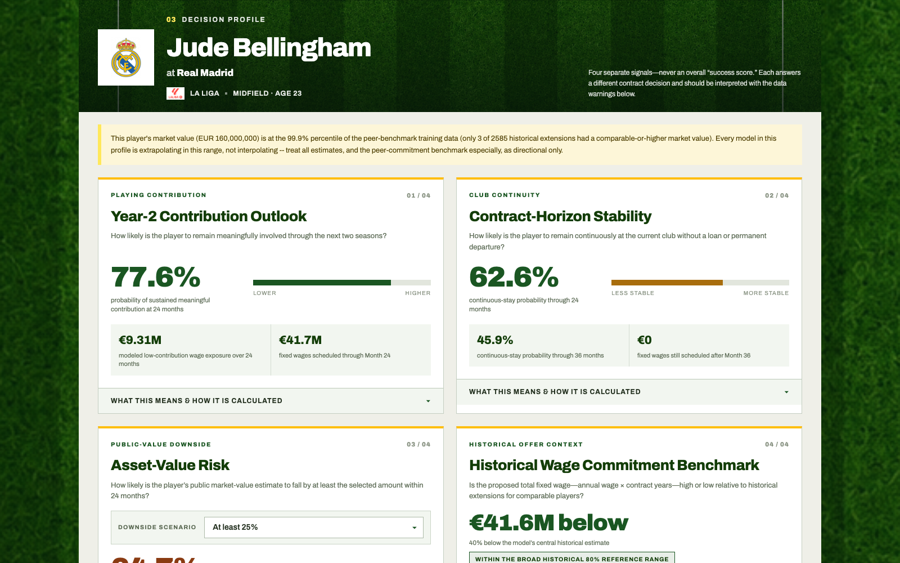

# MoveMaker

**Football Contract Extension Decision Support**

MoveMaker is an explainable research prototype for incumbent-club football contract extensions. In its frozen V1 scoring mode, a user selects a current player and enters proposed wage and term information; the application returns separate, evidence-backed views of:

- meaningful contribution through Year 2;
- continuous stay at the current club;
- 24-month public market-value downside;
- proposed fixed-wage commitment versus historical extension peers; and
- qualified financial exposure tied to low contribution.

MoveMaker is a screening and prioritization tool. It does **not** produce one overall success score, recommend whether a club should extend a player, predict tactical compatibility, or estimate accounting loss or ROI.

> **Current status (2026-08-31):** Engine V1 is frozen and public scoring is paused. Engine V2 Phases 1–5 now define the validity boundary, test decision-time-safe features, audit probability reliability, repair continuity's missing-input failure, freeze a refusal-safe result contract, and enforce a final temporal-evaluation gate. Phase 5 found no valid final 2024 test for the predictive risk modules: role/continuity labels were previously exposed in aggregate, while player-disjoint role and value cohorts are underpowered. The wage benchmark was the only eligible sealed test; it improved pooled error but failed the frozen Ligue 1 interval-coverage gate. The overall engine remains blocked and nothing from V2 is deployed. All three blockers are maintained in the [dedicated critical-issues register](docs/ENGINE_V2_CRITICAL_ISSUES.md). See also the [V1 freeze record](docs/ENGINE_V1_FREEZE.md), [V2 validity boundary](docs/ENGINE_V2_VALIDITY_BOUNDARY.md), [V2 feature specification](docs/ENGINE_V2_FEATURE_SPECIFICATION.md), [V2 reliability gate](docs/ENGINE_V2_CALIBRATION_RELIABILITY.md), [V2 candidate contract](docs/ENGINE_V2_CANDIDATE_CONTRACT.md), and [V2 final-evaluation gate](docs/ENGINE_V2_FINAL_EVALUATION_GATE.md).

**Explore the project:** [hosted research site](https://movemaker-production.up.railway.app/) · [final presentation](slides/final/MoveMaker_Final_Presentation.html) · [model card](docs/MODEL_CARD.md) · [data provenance](docs/DATA_PROVENANCE.md) · [analytical journal](docs/journal/2026-08-11_scope_pivot_journal.md)

[](https://movemaker-production.up.railway.app/)

*Frozen V1 example: a three-year extension profile for Jude Bellingham. The four outputs answer different questions and are intentionally not combined into one recommendation.*

## Why this product exists

The project did not begin with contract extensions. Its scope changed twice because the evidence rejected broader claims:

1. **Player and club compatibility.** The original concept profiled player-player and player-club relationships, then combined those profiles with transfer and financial information to estimate the likely sporting and financial return of a signing. Rich feature requirements reduced the complete cohort to only 63 cases, and larger-cohort diagnostics did not recover a stable general compatibility signal.
2. **Modular transfer-risk screening.** The first pivot separated opportunity, retention, value-downside, fee, and capital-risk questions. Several individual signals were useful, but they could not defensibly be compressed into one transfer-success or ROI score.
3. **Incumbent-club extension decisions.** Big-Five Capology salary and extension data made wage commitment and historical contract context observable. That supported a narrower, financially concrete question: *what should a club investigate before extending a player, and how aggressive are the proposed terms relative to comparable historical extensions?*

The scope pivot is the central research result: more data and more modeling did not justify more certainty. They identified which decisions public data can support and which claims must remain out of scope.

## Headline evidence

All primary results use rolling chronological evaluation and saved independent-verification artifacts.

| Decision signal | Verified evidence | Product use |
| --- | --- | --- |
| Year-2 opportunity | MAE 0.2369, R² 0.249, Spearman 0.512; improvement +0.0586, 95% CI [0.0485, 0.0686], 4/4 origins | Broad future-role outlook, not exact minutes |
| Sustained meaningful contribution | AUC 0.788, AP 0.732, Brier 0.1869; improvement +0.0643, 4/4 origins | Probability of sustaining at least 25% same-club opportunity share in both Year 1 and Year 2 |
| Any outbound by 24 months | AUC 0.710, Brier 0.2191; improvement +0.0363, 4/4 origins | Continuous-stay risk, not an exact departure date |
| Public-value downside by 24 months | AUC 0.821 for a decline of at least 25% | Public valuation risk, not sale proceeds or accounting loss |
| Fixed-wage commitment benchmark | R² 0.644, Spearman 0.832; ~80% empirical reference-range coverage | Proposed commitment versus historical peers, not a “fair” wage |
| Integrated contract score | Three-module AUC 0.6830 versus 0.6885 for opportunity risk alone; difference CI crosses zero | Rejected; signals remain separate |

The financial scale is material. Across 908 out-of-time extension profiles with known terms, €5.22B in two-year fixed wages was scheduled; €1.82B, or 34.8%, was attached to players who did not sustain meaningful contribution through Year 2. At the same 182-extension review capacity, risk-weighted screening identified 79 historical low-contribution outcomes versus 54 from selecting the largest contracts alone—46% more—while concentrating less wage capital in the flagged group. These are historical exposure and prioritization results, not confirmed losses or projected savings.

## Current product

The application combines a FastAPI service with a static HTML front end. The public research site is hosted on Railway with scoring disabled by default; controlled V1 regression testing can still run locally:

```text
api/main.py                         API
html/index.html                     application interface
models/deployment_scorer.py         deployed endpoint orchestration
models/canonical_feature_retriever.py
Data/processed/deployment_models/   serialized model artifacts and manifest
```

The frozen V1 profile exposes 16 separately evaluated endpoints rather than a composite score. The sustained-contribution endpoint uses the later C6 compact model, which removed unstable goals/assists-per-90 inputs and passed the declared non-inferiority and deployment-parity checks. The role-contextualization diagnostic is research-only and did not replace the remaining V1 endpoints.

### Run locally

```bash
python -m pip install -r requirements.txt
MOVEMAKER_ENABLE_SCORING=true python -m uvicorn api.main:app --host 127.0.0.1 --port 8000
```

Then open [http://127.0.0.1:8000/](http://127.0.0.1:8000/). The explicit environment flag is for controlled V1 regression testing only. Without it, the site starts in its safe research-prototype state and does not load models or runtime data.

For hosted deployment, see the [Railway deployment guide](docs/RAILWAY_DEPLOYMENT.md). Large runtime tables are supplied through a Railway volume rather than committed to Git.

## Repository map

```text
api/                    FastAPI service
html/                   user-facing extension profile
models/                 research runners, production scoring, and feature retrieval
scripts/                builders and independent verifiers
docs/                   journal, report evidence, diagnostics, and publication policy
Data/processed/         compact auditable evidence; large row-level artifacts stay local
slides/final/           final presentation assets
```

See [models/README.md](models/README.md) for the experiment and verifier registry, the [scope-pivot journal](docs/journal/2026-08-11_scope_pivot_journal.md) for the analytical history, and [docs/GITHUB_PUBLICATION_MANIFEST.md](docs/GITHUB_PUBLICATION_MANIFEST.md) for what belongs in Git.

## Project team

MoveMaker was developed as a four-person capstone project. The repository and deployed demo represent the shared project deliverable.

- **Lionel** — Project Coordinator and ML Lead
- **Evelyn** — Scrum Master
- **Derick** — Deliverable Architect
- **Rene** — Tech Auditor

## Reproducibility and evidence

Each finalized stage has:

- a runner under `models/` or builder under `scripts/`;
- a dedicated verifier under `scripts/`;
- a source manifest, output manifest, build checks, decision summary, and independent-verification report under `Data/processed/`.

The compact Git evidence is intended to audit reported conclusions. Full raw data, large canonical tables, row-level training matrices, candidate artifacts, and predictions remain local because of size, licensing, and reviewability.

This repository is therefore an **auditable publication baseline**, not a zero-data rebuild bundle. See the [data-provenance statement](docs/DATA_PROVENANCE.md) for source boundaries and the [model card](docs/MODEL_CARD.md) for intended use, evaluation, and limitations.

## Claim boundaries

- Extension probabilities apply to incumbent-club extensions, not hypothetical destination-club transfers.
- “Low contribution” means failing to sustain at least 25% same-club opportunity share in both Year 1 and Year 2; it does not necessarily mean fewer than 25% of all possible minutes across the full two-year window.
- Outbound means any recorded move away from the incumbent club in the stated horizon, including loan or permanent movement where the endpoint says “any outbound.”
- Public market value is a public estimate, not a realized transfer fee, cash flow, or accounting valuation.
- Fixed wages exclude bonuses, taxes, agent fees, clauses, and options unless explicitly stated.
- Risk-weighted wage exposure is a prioritization proxy, not expected loss, wasted wages, or projected savings.
- Historical peer estimates describe observed comparable contracts; they are not optimal terms or fair value.
- Missing inputs remain unavailable rather than being silently converted to zero.

## Continuing the project

The presentation milestone is complete, but development is not. Phase 5 has
shown that none of the current V2 candidates is authorized for an artifact:
the predictive modules lack a valid final cohort, continuity also fails a
development-stage league gate, and the wage benchmark failed final Ligue 1
coverage. The next work should improve validity and deployability rather than
widen the claims:

1. freeze any proposed continuity repair before testing it on later, fully observed data; add genuinely new club/squad context only in a separately declared candidate;
2. preserve the failed/contaminated 2024 evidence and reserve a later, fully mature, player-disjoint cohort before opening another final temporal test;
3. declare any successor wage candidate as a new version without fitting to the failed 2024 final labels, then test it only on later untouched evidence;
4. build versioned artifacts and API parity checks only for modules that pass their immutable final evaluation;
5. refresh current performance and salary inputs without contaminating frozen chronological evidence; and
6. add richer injury, squad-competition, option, clause, and internal club data only when coverage supports a new claim.

## Research record

- [Scope-pivot journal](docs/journal/2026-08-11_scope_pivot_journal.md)
- [Research-paper evidence bank](docs/research/2026-08-11_report_evidence_bank.md) — historical transfer-risk pivot
- [Data-readiness audit](docs/DATA_READINESS_AUDIT.md) — historical pre-extension scope
- [Contract diagnostic checklist](docs/diagnostics/contract_scope_diagnostic_checklist.md)
- [Final presentation](slides/final/MoveMaker_Final_Presentation.html)

## License and reuse

No open-source license is currently granted for this repository. The code and documentation are visible for review, but reuse rights are not implied. Third-party football data is not redistributed and remains subject to its original providers' terms.

MoveMaker’s core lesson is simple: the strongest product was not the broadest model. It was the one whose claims survived chronological testing and could be translated into a concrete financial decision.
